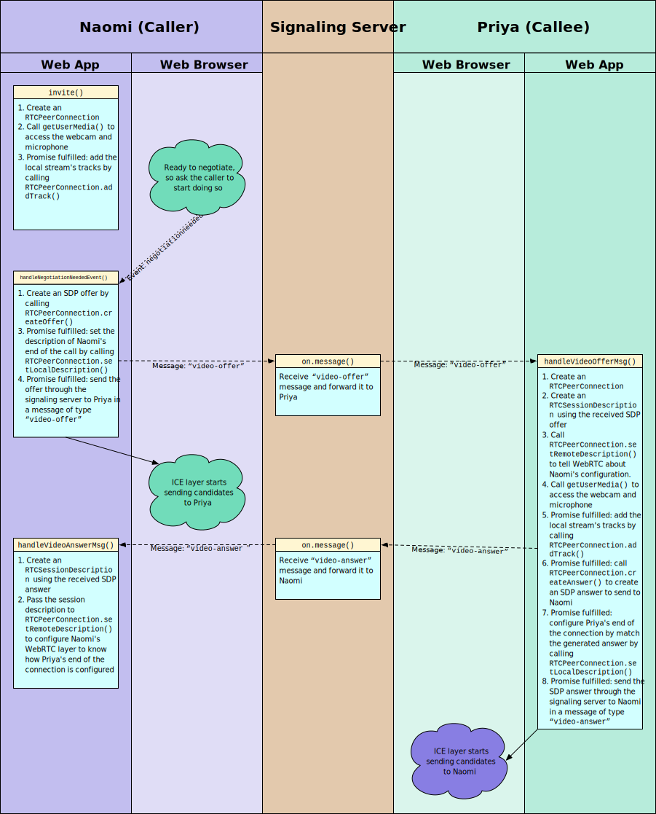
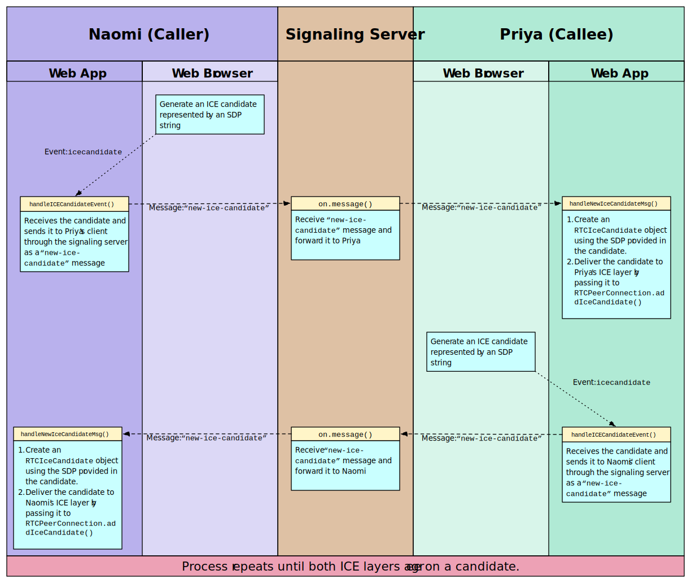

## Waves 

a minimal peer-to-peer web video chat app

**live & usage:**

you can access this project via a custom domain: **https://waves.cam** 
the `.cam` domain is used since the `.com` variant is already occupied.

- allow **camera and microphone permissions** when prompted  
- ensure your browser supports modern WebRTC features  
- use a modern browser (Chrome, Safari, Firefox, etc.) for best experience  

**features:**
- direct browser video call with another user
- simple login, pick a name and see who’s online
- click a user to call, accept or reject calls
- pip-like local camera box
- hang up anytime

**getting started:**
1. install bun (https://bun.sh/)
2. run `bun install`
3. start dev server: `bun run dev`
4. visit http://localhost:3000/

to build browser bundle:
`bun run build:browser`

**tech stack:**
- typescript
- bun runtime
- native web apis: [WebRTC](https://developer.mozilla.org/en-US/docs/Web/API/WebRTC_API), [WebSocket](https://developer.mozilla.org/en-US/docs/Web/API/WebSockets_API), [DOM](https://developer.mozilla.org/en-US/docs/Web/API/Document_Object_Model), [CSS](https://developer.mozilla.org/en-US/docs/Web/CSS)

**how it works:**
- [WebRTC Signaling & Connections (MDN Guide)](https://developer.mozilla.org/en-US/docs/Web/API/WebRTC_API/Signaling_and_video_calling)
- For in-depth details, check out:
  - [MDN: WebRTC API](https://developer.mozilla.org/en-US/docs/Web/API/WebRTC_API)
  - [MDN: WebSockets API](https://developer.mozilla.org/en-US/docs/Web/API/WebSockets_API)

**websocket & webrtc signaling diagram:**

**webrtc ice candidate gathering:**

**notes:**

- audio/video features will not work without **HTTPS**  
- webSocket connections use secure protocol: `wss://`  
- if the app fails to connect, check browser permissions for camera/microphone  
- for demo and learning use.
